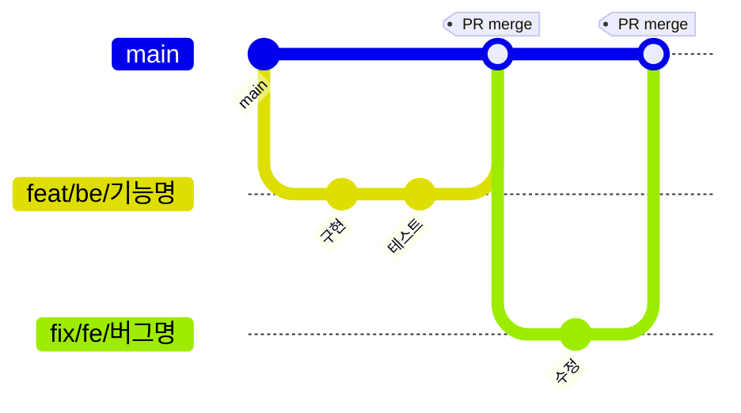
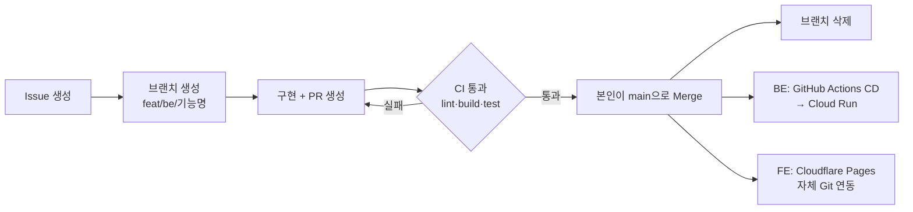

# BreadBread 개발 가이드라인

## 협업 규칙

### 브랜치 전략 (GitHub Flow)

`main` 단일 브랜치로 배포하는 **GitHub Flow**를 사용합니다.  
`develop`/`release`/`hotfix` 브랜치를 두는 Git Flow와 달리, 작업 브랜치를 `main`에 직접 PR합니다.



#### 브랜치 명명 규칙

| 타입 | 형식 | 예시 |
|------|------|------|
| FE 기능 | `feat/fe/<기능명>` | `feat/fe/bakery-detail` |
| BE 기능 | `feat/be/<기능명>` | `feat/be/route-optimization` |
| FE 버그 | `fix/fe/<버그명>` | `fix/fe/login-redirect` |
| BE 버그 | `fix/be/<버그명>` | `fix/be/walking-route` |
| FE 문서 | `docs/fe/<작업명>` | `docs/fe/api-guide` |
| BE 문서 | `docs/be/<작업명>` | `docs/be/docs-accuracy` |
| 그 외 유지보수 | `chore/<작업명>` | `chore/dependabot-setup` |

- 기능명은 **소문자 케밥케이스** 사용 (`bakery-import-preview`)
- 한 브랜치에 하나의 기능/버그만 작업

### PR 프로세스 · 배포 흐름



1. **Issue 생성** → 작업 내용 정의
2. **브랜치 생성** → `git checkout -b feat/fe/기능명`
3. **작업 후 PR 생성** → 제공된 PR 템플릿 작성. Branch Protection으로 `main` 직접 push가 막혀 있어 PR 생성이 필수
4. **CI 확인** → FE는 lint/타입체크, BE는 spotlessCheck/build/test 통과 확인 (`.github/workflows/ci.yml`)
5. **CI 통과 후 merge** → 브랜치 삭제 → `main` 반영분이 자동 배포(BE: Cloud Run, FE: Cloudflare Pages)로 이어짐

> FE/BE 담당이 한 명씩으로 명확히 나뉜 2인 체제라 상호 코드 리뷰는 진행하지 않고, PR 생성 + CI 통과를 품질 게이트로 사용합니다.

### 커밋 메시지 규칙

| 타입 | 설명 | 예시 |
|------|------|------|
| `feat` | 새로운 기능 추가 | `feat: 베이커리 목록 페이지 구현` |
| `fix` | 버그 수정 | `fix: 로그인 토큰 만료 처리 오류 수정` |
| `docs` | 문서 추가 및 수정 | `docs: API 명세 업데이트` |
| `chore` | 설정, 패키지 등 | `chore: dependabot 설정 추가` |
| `refactor` | 리팩토링 (기능 변경 없음) | `refactor: CourseService 메서드 분리` |
| `style` | 스타일 변경 (CSS 등) | `style: 버튼 여백 조정` |

### 패키지 설치 규칙

패키지는 **루트에서 명령어를 실행**하지만, `apps/fe/package.json`에 등록됩니다.

```bash
# FE 패키지 설치 → apps/fe/package.json에 추가됨
pnpm add 패키지명 --filter fe

# 개발 의존성
pnpm add -D 패키지명 --filter fe
```

### 주의사항

- **main에 직접 push 금지** — Branch Protection이 설정되어 있습니다
- **`.env` 파일 커밋 금지** — 시크릿 키가 포함됩니다 (`.gitignore` 적용됨)
- **`pnpm install`은 루트에서만** — `apps/fe` 안에서 실행하지 마세요
- **PR merge 후 브랜치 삭제** — GitHub에서 "Delete branch" 클릭

---

## API 명세 확인

- [API 문서 (Scalar)](https://api.breadbread.io/api-docs.html)

---

## 문의

작업 중 막히는 부분은 팀 채널에 공유해주세요.
